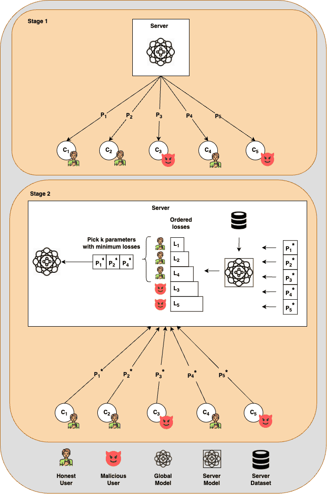

## Federated Learning: Attacks & Defences


This repository contains a Flower Federated Learning (FL) simulation incorporating both attack and defense mechanisms. Specifically, it includes Label Flipping and Byzantine Attack as attack 
strategies, while the provided defense mechanism is illustrated in the accompanying diagram.

The simulation is fully configurable via a YAML file, located in the configs directory. Each YAML file allows users to define parameters for the `server`, `client`, `model`, `attack`, and `defense` 
components.
## Prerequisites

- Python 3.12+
- Poetry for dependency management: `pip install poetry`

## Installation

Install dependencies using Poetry at the repo root:

```sh
poetry install
```

Now that you've set your poetry dependencies, you can set the configuration yaml file as an environmental variable 
and run the simulation script using Poetry:

```bash
export config_file_name=config
poetry run simulation
```
The configs directory contains predefined YAML configuration files designed for simulating various attacks, such as config_byzantine_attack and config_label_flipping.
To apply a specific configuration, simply update the corresponding environment variable with the desired YAML file name.

